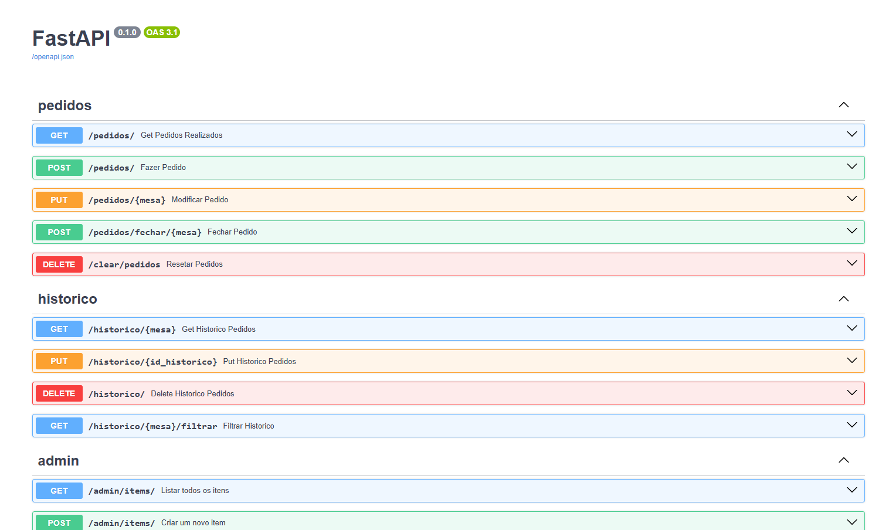

# Cardapio ESS - Project - G2_2025.1!

## Sobre o Projeto

O Projeto Base de ESS utiliza o conceito de ***[Subtrees]('https://www.atlassian.com/br/git/tutorials/git-subtree')*** do Git para integrar dois repositórios separados, um para o *backend* e outro para o *frontend*. Esses repositórios são clonados dentro deste projeto, em pastas separadas, permitindo o desenvolvimento simultâneo das camadas de *frontend* e *backend*.


## Passo a Passo 🚶
### Backend
---
### Da execução do projeto <br>
```O Backend do projeto pode ser encontrado em .\DELIVERY_ESS_G2\backend.```<br>
As pastas principais para a execução do Backend são:

```py
$ uvicorn src.main:app --reload
```
* `OBS¹`: Para esse comando funcionar instale o arquivo `requirements.txt` e se certifique-se de estar na pasta do backend; 

---

## Acessando a API

Acesse a documentação em [http://localhost:8000/docs](http://localhost:8000/docs) quando a API subir.

